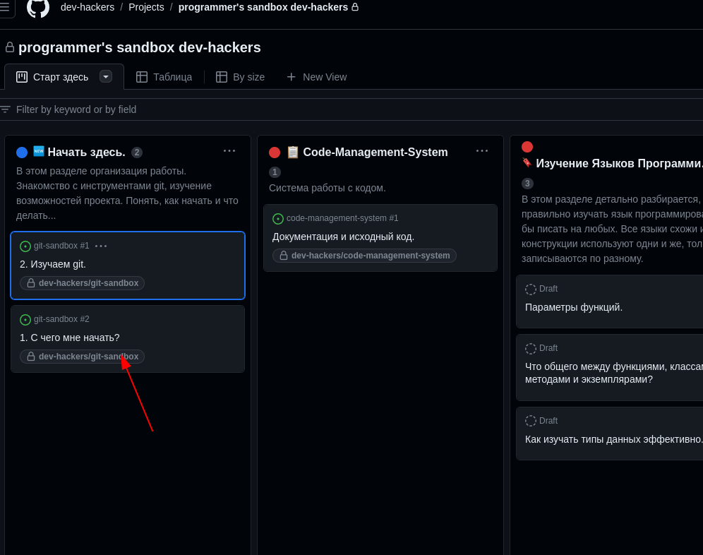

Будем использовать следующее на этом этапе.
Смотрите ребята. Все будет дополняться.

Цель научится писать продукт в команде.
Моментальное изучение конструкций языка.

Процесс обучения, это только первый этап, что удалось спланировать опираясь на github, все расширится. намного.

Сейчас занимаюсь тем, что составляю инструкцию. НЕ рассматривайте это , как конечный вариант, все будет изменяться в зависимости от пользы и здравого смысла.

Ещё раз осознаем цель.
Профессиональный программист должен выходить из процесса.

Подготовительный уровень:
Сейчас как раз над нима работаю, поэтому писать много не буду.

Что нужно уметь, сложного ничего нет.
git основы
далее там будет расписан учебный процесс. который ниже выстраивается, то есть что бы каждый представлял, что делать.
Сейчас в работе.
Доступ открытый, что бы люди могли подготовится.

    1. Все Начинается  с проекта.(песочницы)
Путь практики с нуля, до понимания конструкций.
доступ закрытый, только для участников.

это здесь:

https://github.com/users/dev-hackers/projects/5

в dev-hackers, начинается работа, которая будет переплетаться с вашим личным аккаунтом.

    Каждый репо имеет дискуссию(типа форума.), не путать с issue(обсуждением). Здесь будут обсуждаться вопросы, которые важно понимать всем и любые другие важные вопросы.
    
    Обсуждения в проекте, о проекте.
    Мой личный репо. Появляется возможность Вы будете работать в своих репо и присылать ссылки.

    Что бы была возможность работать, как в группе в школе, буду давать задания и Вы будете присылать pull-request, если тема очень важная, то будет добавляться обусуждение и дискуссия.

    Когда нужен рост и что бы ученик думал. Когда нужно,  что то нужно доработать, то будет создаваться проблема(так называется раздел) и назначаться ученику, над которой он будет работать до решения. Данный вопрос, может быт превращен в обсуждение или дискуссию, после того, как человек разобрался.

    2. Ещё направление. Работа в команде над проектом.
    Отработать небольшой командой над одним репозиторием с отдельными ветками.

    работать над большим проектом большой командой с несколькими репозиториями и ветками.

    Попробуем настроить. что бы каждый мог работать в своей директории в репо.
    Так как основное это код.

Сюда добавляется обсуждение и дискуссия в обязательном порядке.
так же, каждый кому интересно учавсвтует в написании справки, что бы довести до автоматизма.

Программирование.

С ++ становится обязательным для изучения.

**Питон обязательным.**

Вы можете выбрать сами любые другие языки и технологии.
Например блокчейн, ИИ, веб, мобилы.
Важно. что бы тама вас интересовала.

сам план находится здесь в проекте.

https://github.com/users/dev-hackers/projects/5